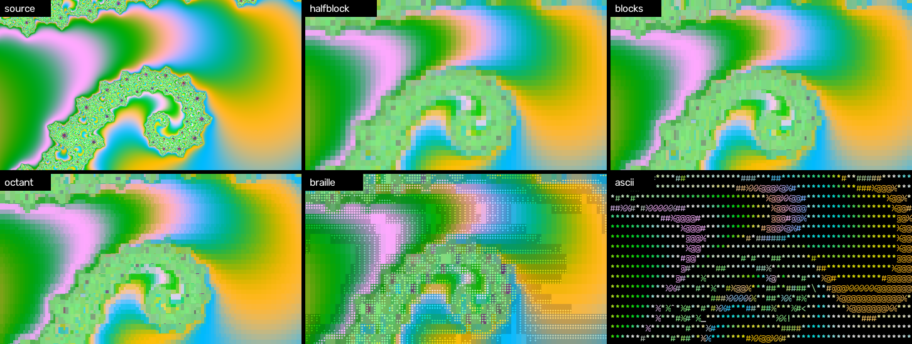
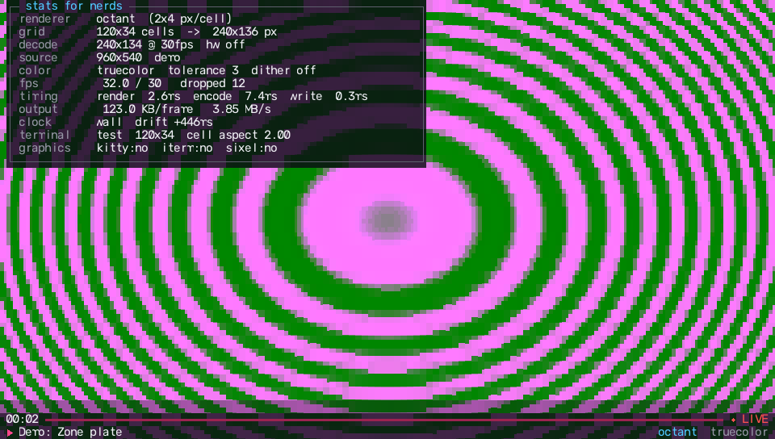
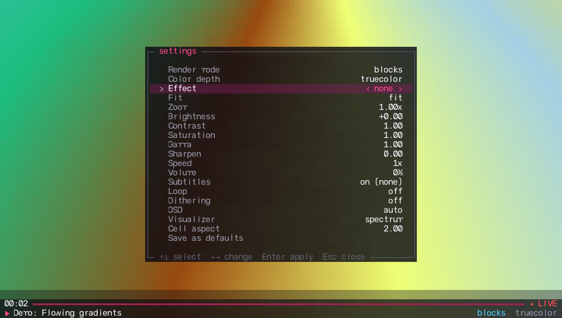
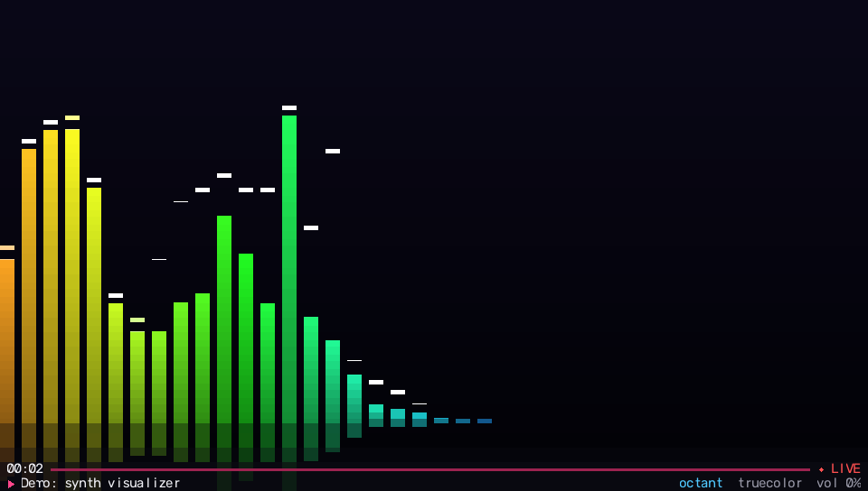
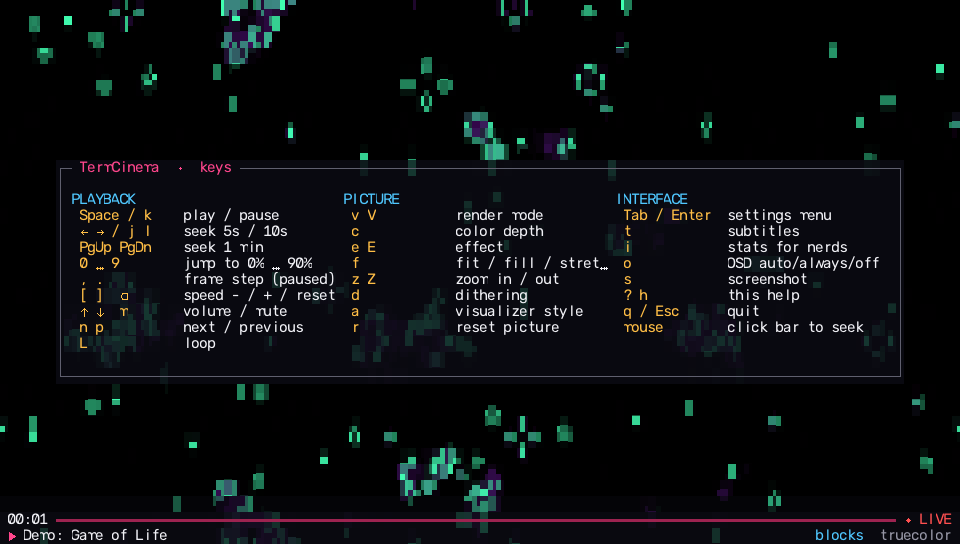

# TermCinema

**Watch anything in your terminal.** Local files, YouTube (search it right from the terminal), Twitch, playlists, your webcam, your desktop, or a generative demo, rendered as crisp sub-cell block art or, on terminals that support it, real pixels.



```bash
termcinema                                  # home screen: search, recents, demos
termcinema movie.mkv
termcinema "lofi hip hop radio"             # search YouTube, pick with thumbnails
termcinema "https://youtu.be/…" --mode octant --effect vivid
termcinema webcam
termcinema demo:synth                       # generative music + audio visualizer
```

## What makes it good

**Picture quality**
- **Two-color best-fit block rendering.** Each character cell is treated as a tiny two-color image. TermCinema picks the glyph shape *and* both colors that reproduce the source pixels with the least error: an exact search over every candidate shape for small glyph sets, and a per-cell 2-means split for the 256-pattern octant/braille sets. Edges come out sharp instead of mushy.
- **12 renderers:** `blocks` (default, uses only classic Block Elements every terminal draws), `octant` (2×4, Unicode 16), `sextant` (2×3), `quadrant`, `halfblock`, `braille`, shape-matched `ascii`, classic `ascii-ramp`, plus real-pixel `kitty`, `iterm` and `sixel`.
- **Real pixels where available:** kitty graphics protocol (kitty, Ghostty, WezTerm), iTerm2 inline images (iTerm2, WezTerm, VS Code), sixel (Windows Terminal 1.22+, foot, xterm, VS Code). Detected automatically by querying the terminal.
- **Accurate color:** 24-bit by default, including on Windows. The 256/16-color fallbacks map to the nearest palette entry in CIE L\*a\*b\*, with optional ordered dithering.
- **21 effects:** vivid, cyberpunk, synthwave, thermal, night vision, neon edges, CRT, VHS, cartoon, matrix, Nord/Dracula/Gruvbox/Catppuccin duotones… plus live brightness, contrast, saturation, gamma and sharpening.

**Playback**
- **Audio is the master clock.** Audio is decoded by ffmpeg and played through PortAudio. Video frames are timed against the samples the sound card has actually consumed, so sync holds; late frames are dropped, never slowed.
- **Streams, not downloads.** yt-dlp resolves the stream and ffmpeg plays it directly (with the site's required headers), so seeking anywhere in a 3-hour video is instant.
- Instant pause, live volume, speed 0.25×–4× with pitch correction, frame stepping, chapters, loop and shuffle, playlists and folders, **resume where you left off**, and subtitles (sidecar `.srt`/`.vtt`, embedded tracks, or YouTube captions).

**Interface**
- A translucent on-screen display composited *into* the picture: progress bar with buffer and chapter marks, toasts, and help. The video stays visible behind it.
- Settings menu (`Tab`), stats-for-nerds overlay (`i`), mouse support (click the bar to seek, scroll for volume).
- Home screen with search, recent history, and demos. YouTube search results show thumbnails rendered in the terminal.
- Screenshots (`s`) save a PNG of exactly what the terminal shows, plus an `.ans` file you can `cat`.

<p align="center">
   
   
</p>

## Why it's fast

Terminal video usually bottlenecks on *writing escape codes*, not image math. TermCinema never loops over cells in Python:

1. **Vectorized ANSI encoder.** Every cell reserves a fixed-width byte slot `[cursor move][SGR fg;bg][UTF-8 glyph]`, filled in with NumPy arithmetic alongside a "keep" mask that drops leading zeros, repeated colors and redundant cursor moves. One boolean gather produces the frame.
2. **On-screen diffing.** The encoder remembers what the terminal is showing and sends only the cells that changed. Short unchanged gaps are repainted because jumping over them costs more bytes. An unchanged frame costs 0 bytes.
3. **Adaptive color tolerance.** If the terminal can't keep up, cells whose color drifted by less than a threshold are skipped. The threshold is measured against what's actually on screen, so error stays bounded.
4. **numba kernels** for the per-cell fitting and the sixel encoder (pure-NumPy fallbacks exist).
5. **Synchronized output** (DEC mode 2026), so frames never tear.

`termcinema bench` on the development machine (160×45 cells, truecolor):

| mode      | render  | encode | max fps |
|-----------|---------|--------|---------|
| halfblock | 0.3 ms  | 4.0 ms | ~236 |
| blocks    | 3.7 ms  | 2.7 ms | ~158 |
| octant    | 2.7 ms  | 2.6 ms | ~191 |
| braille   | 0.9 ms  | 4.0 ms | ~205 |
| sixel     | —       | 12 ms  | ~82  |

Run it yourself: `termcinema bench yourvideo.mp4`. In practice your terminal emulator's throughput is the real limit.

## Install

Requires **Python 3.10+** and **ffmpeg** on your PATH.

```bash
# ffmpeg
winget install Gyan.FFmpeg        # Windows
brew install ffmpeg               # macOS
sudo apt install ffmpeg           # Debian/Ubuntu

# TermCinema
git clone https://github.com/PS12007/termcinema
cd termcinema
pip install .
termcinema doctor                 # check everything
```

`termcinema doctor` checks your dependencies, detects what your terminal supports (true color, kitty/iTerm2/sixel graphics, cell size) and prints a color and glyph test.

## Usage

| Source | Example |
|---|---|
| File / folder | `termcinema clip.mp4`, `termcinema ~/Videos --shuffle` |
| YouTube & 1000+ sites | `termcinema "https://www.youtube.com/watch?v=…"` |
| Playlists | `termcinema "https://www.youtube.com/playlist?list=…"` |
| Search | `termcinema "blender open movie"` |
| Audio / music | `termcinema song.flac`, `termcinema "<url>" --audio-only` |
| Images & GIFs | `termcinema photo.jpg`, `termcinema reaction.gif` |
| Webcam | `termcinema webcam` |
| Desktop | `termcinema screen` |
| Live streams | `termcinema rtsp://camera.local/stream` |
| Demos | `termcinema demo:mandelbrot` (also `life`, `gradients`, `sierpinski`, `zoneplate`, `cellauto`, `synth`) |

Handy flags: `--mode`, `--effect`, `--color 256`, `--fit fill`, `--start 1:23`, `--speed 1.5`, `--subs en`, `--quality 480`, `--loop`, `--no-audio`, `--cell-aspect 2.2`. See `termcinema --help` for everything.

**Tools**

```bash
termcinema clip.mp4 --snapshot frame.png --at 1:30    # PNG of the rendered frame
termcinema photo.jpg --print --width 80                # ANSI art into your scrollback
termcinema bench clip.mp4                              # renderer speed on your machine
termcinema clip.mp4 --mode octant --effect vivid --save-config   # make these your defaults
```

## Controls

| Key | Action | Key | Action |
|---|---|---|---|
| `Space` `k` | play / pause | `v` / `V` | next / previous render mode |
| `←` `→` | seek 5 s | `c` | color depth |
| `j` `l` | seek 10 s | `e` / `E` | next / previous effect |
| `PgUp` `PgDn` | seek 1 min | `f` | fit / fill / stretch |
| `0`…`9` | jump to 0 %…90 % | `z` / `Z` | zoom in / out |
| `,` `.` | frame step (paused) | `r` | reset picture |
| `[` `]` `⌫` | speed down / up / reset | `t` | subtitles |
| `↑` `↓` | volume | `i` | stats for nerds |
| `m` | mute | `Tab` | settings menu |
| `n` `p` | next / previous item | `s` | screenshot |
| `L` | loop | `o` | OSD auto / always / off |
| `a` | visualizer style | `?` | help |
| mouse | click bar to seek, wheel = volume | `q` `Esc` | quit |

## Terminal tips

- **VS Code:** enable `terminal.integrated.enableImages` for real-pixel video (iTerm2/sixel). Without it, `blocks` mode looks great too.
- **Windows:** Windows Terminal 1.22+ supports sixel. TermCinema switches the console to VT mode and UTF-8 itself, so colors come out right.
- **Stretched picture?** Fonts differ in cell height. Adjust *Cell aspect* in the settings menu, or pass `--cell-aspect`.
- **Boxes instead of shapes** in `octant`/`sextant`: your font lacks those glyphs. Use `blocks`, which only needs classic block elements.
- **YouTube errors (403, format not available):** `pip install -U yt-dlp`.

## Architecture

```
termcinema/
  cli.py             argument parsing, terminal session, search flow
  player.py          pipelines, A/V clock, frame scheduling, drawing, controls
  filters.py         picture adjustments and effects
  config.py          TOML config, watch history, resume positions
  doctor.py          doctor, bench, snapshot/print
  term/
    control.py       Windows VT/UTF-8 setup, raw mode, binary output
    caps.py          capability detection (env + DA1/XTWINOPS/kitty probes)
    keys.py          keyboard/mouse/terminal-reply parser
  media/
    inputs.py        ffprobe metadata, ffmpeg input args (headers, seeking)
    source.py        files, folders, URLs, playlists, webcam, screen, demos
    ytdl.py          yt-dlp resolve / search / subtitles
    video.py         ffmpeg -> constant-frame-rate RGB frames
    audio.py         ffmpeg -> PortAudio, the master clock (ffplay fallback)
    subtitles.py     SRT / WebVTT parsing
  render/
    text.py          block, octant, sextant, quadrant, halfblock, braille, ascii
    kernels.py       numba per-cell fitting
    pixels.py        kitty, iTerm2, sixel encoders
    encode.py        vectorized, diffing ANSI encoder
    palette.py       256/16-color quantization in L*a*b*
    glyphs.py        octant/sextant/braille tables (from Unicode 16 data)
    raster.py        cell frame -> PNG (screenshots)
  ui/
    canvas.py        translucent overlay compositing
    osd.py           bar, toasts, help, stats, menu, subtitles
    layout.py        fit / fill / stretch / zoom geometry
    visualizer.py    spectrum, mirror, wave, radial
    home.py          home screen and search picker
```

## Development

```bash
pip install -e ".[dev]"
pytest
```

The tests replay the encoder's output through a small terminal interpreter and check that the screen matches the intended frame, including incremental diffs and color tolerance. They also round-trip the sixel encoder through a decoder and check renderers, input parsing, subtitles, layout and effects.

## License

MIT
